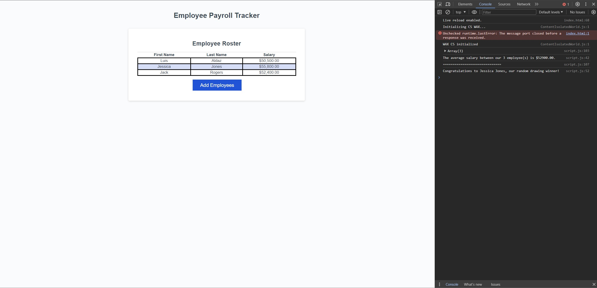

# Employee Payroll Tracker (Module 03 JavaScript Challenge ) 

## This Challenge contains my employee payroll tracker to include the following functions:
- Tracks Employees first name, last name, and salary
- In the console it logs how many employees and the average salary between those employees
- Additionally, the console will also log a random winner from the employees list

## Installation
- To access my employee payroll tracker website follow link: https://ricanlonghorn23.github.io/Employee-Payroll-Tracker/
- To Access my Employee Payroll Tracker repository: https://github.com/ricanlonghorn23/Employee-Payroll-Tracker.git

## Usage
The usage of this application for any employer who is wanting to get a list of employees and also track the average salary and how many employees they have. Additionally, if the employer would like to choose a random employee for a prize, the console has that function as well. It will randomly choose an employee and display the winner in the console. 

## Credits
Luis Aldaz

